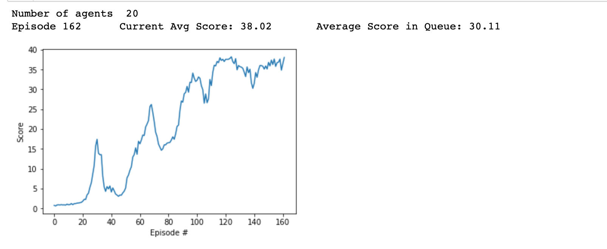

[//]: # (Image References)

[image1]: https://user-images.githubusercontent.com/10624937/43851024-320ba930-9aff-11e8-8493-ee547c6af349.gif "Trained Agent"
[image2]: https://user-images.githubusercontent.com/10624937/43851646-d899bf20-9b00-11e8-858c-29b5c2c94ccc.png "Crawler"

# Project 2: Continuous Control

I solved the [Reacher](https://github.com/Unity-Technologies/ml-agents/blob/master/docs/Learning-Environment-Examples.md#reacher) in this repo. In this environment, a double-jointed arm can move to target locations. A reward of +0.1 is provided for each step that the agent's hand is in the goal location. Thus, the goal of your agent is to maintain its position at the target location for as many time steps as possible.

The observation space consists of 33 variables corresponding to position, rotation, velocity, and angular velocities of the arm. Each action is a vector with four numbers, corresponding to torque applicable to two joints. Every entry in the action vector should be a number between -1 and 1.

Specifically, I solved the environment where 20 identical agents, each with its own copy of the environment [click here](https://s3-us-west-1.amazonaws.com/udacity-drlnd/P2/Reacher/Reacher.app.zip).  The task is episodic, and in order to solve the environment and its considered complete if agent gets an average score of +30 over 100 consecutive episodes. 

After each episode, we add up the rewards that each agent received (without discounting), to get a score for each agent.  This yields 20 (potentially different) scores.  We then take the average of these 20 scores. 
- This yields an **average score** for each episode (where the average is over all 20 agents).

The environment is considered solved, when the average (over 100 episodes) of those average scores is at least +30. 

# Solution 

 `Continuous_Control.ipynb` contains the solution that solves this environment and acheives a score of at least 30 averged over 20 agents for at least 100 consecutive episodes as shown . 
 
 I solved this problem using Actor-Critic with DDPG. You can find the model architectures for Actor and the Critic . In order to solve this problem I used a replay buffer, OUNoise, and clipping the gradient norm in the critic model. I used DDPG to solve this environment and blending the weights between the local and the target network. You can find the code here . 
 
 The best weights for the best actor and critic model can be found  and . 

